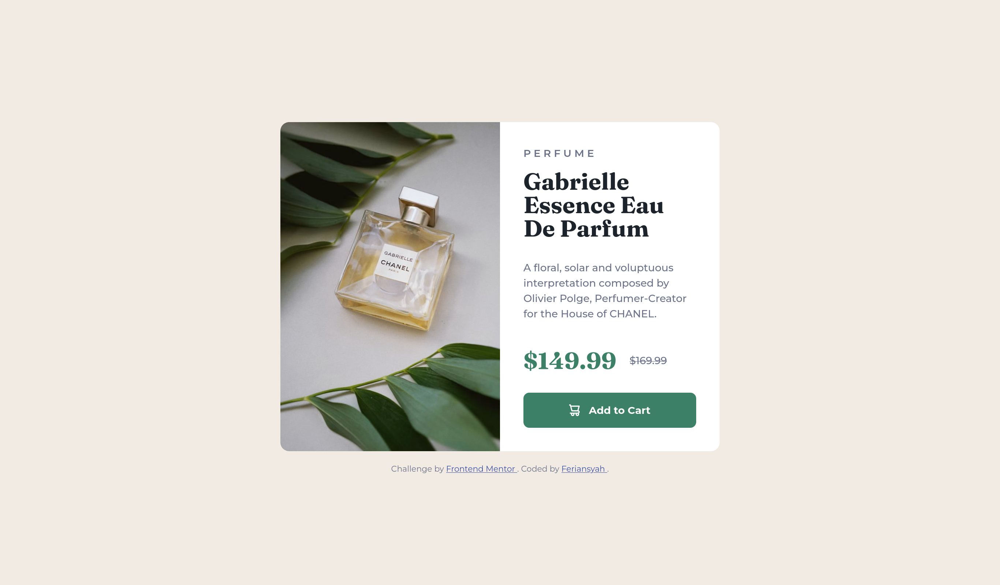

# Frontend Mentor - Product preview card component solution

This is a solution to the [Product preview card component challenge on Frontend Mentor](https://www.frontendmentor.io/challenges/product-preview-card-component-GO7UmttRfa)

## Table of contents

- [Frontend Mentor - Product preview card component solution](#frontend-mentor---product-preview-card-component-solution)
  - [Table of contents](#table-of-contents)
  - [Overview](#overview)
    - [The challenge](#the-challenge)
    - [Screenshot](#screenshot)
    - [Links](#links)
  - [My process](#my-process)
    - [Built with](#built-with)
    - [Testing and Accessibility](#testing-and-accessibility)
    - [What I learned](#what-i-learned)
    - [Useful resources](#useful-resources)
  - [Tools I Use](#tools-i-use)

## Overview

### The challenge

Users should be able to:

- View the optimal layout depending on their device's screen size
- See hover and focus states for interactive elements

### Screenshot

Screenshots of the project on desktop and mobile:

### Links

- Live Site URL: [Live Site](https://frontendmentor-product-preview-card-one.vercel.app/)

## My process

### Built with

- Semantic HTML5 markup
- CSS custom properties
- Flexbox
- CSS Grid
- Mobile-first workflow

### Testing and Accessibility

- Set the browser's font size on desktop to various values to ensure everything scales properly based on the user's preferred font size
- Zoomed the page in and out to check for responsiveness
- Used Firefox DevTools and ResponsivelyApp to check the website's responsiveness

### What I learned

- **Creating Equal-Width Flexbox Children**: I learned that to make flexbox children have equal widths, using the shorthand `flex: 1 1 50%` is effective. Initially, I thought that simply using `flex: 1` would suffice, as it sets `flex-basis: 0%` and `flex-grow: 1`, which should theoretically give each element equal width. However, when rendered, the image section ended up being `268px (44.67%)`, while the content section was `332px (55.33%)`, instead of both being `300px`. This taught me that specifying the correct `flex-basis (e.g., 50%)` is crucial for achieving the desired equal-width layout when working with image.
- **Using the `<picture>` Tag for Responsive Images**: I also learned how to use the `<picture>` tag to change image URLs based on the viewport size. This allows for more control over which image is displayed, ensuring optimal performance and user experience across different screen sizes.

### Useful resources

- [MDN - picture: The Picture element](https://developer.mozilla.org/en-US/docs/Web/HTML/Element/picture) - This helped me understand what the `picture` tag is and how to use it for changing images based on viewport

## Tools I Use

- [Pixel Perfect Pro by max](https://addons.mozilla.org/en-US/firefox/addon/pixel-perfect-pro/) - A Firefox extension that enables you to overlay an image over a webpage, making it easier to spot pixel differences between your result and the design
